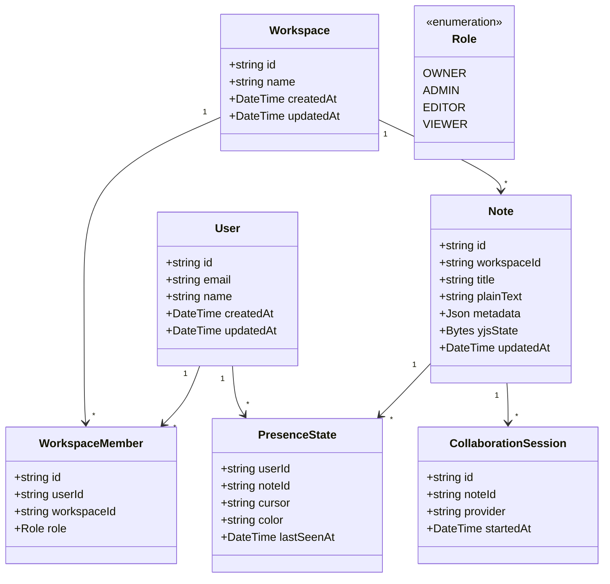
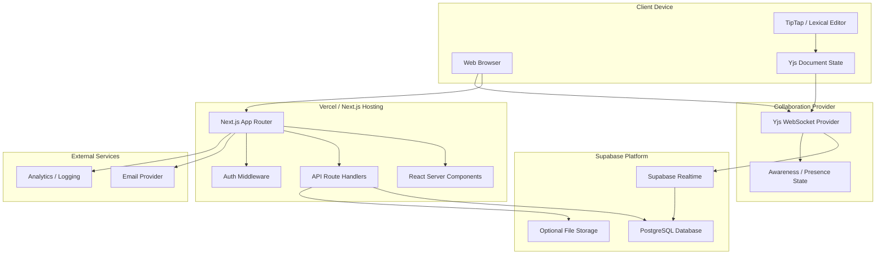
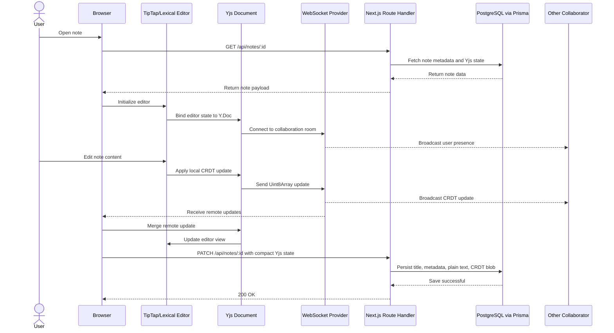

# astraNotes UML Diagrams

## Class Diagram

```mermaid
classDiagram
  class User {
    +string id
    +string email
    +string name
    +DateTime createdAt
    +DateTime updatedAt
  }

  class Workspace {
    +string id
    +string name
    +DateTime createdAt
    +DateTime updatedAt
  }

  class WorkspaceMember {
    +string id
    +string userId
    +string workspaceId
    +Role role
  }

  class Note {
    +string id
    +string workspaceId
    +string title
    +string plainText
    +Json metadata
    +Bytes yjsState
    +DateTime updatedAt
  }

  class CollaborationSession {
    +string id
    +string noteId
    +string provider
    +DateTime startedAt
  }

  class PresenceState {
    +string userId
    +string noteId
    +string cursor
    +string color
    +DateTime lastSeenAt
  }

  class Role {
    <<enumeration>>
    OWNER
    ADMIN
    EDITOR
    VIEWER
  }

  User "1" --> "*" WorkspaceMember
  Workspace "1" --> "*" WorkspaceMember
  Workspace "1" --> "*" Note
  Note "1" --> "*" CollaborationSession
  Note "1" --> "*" PresenceState
  User "1" --> "*" PresenceState
```

## Deployment Diagram

```mermaid
flowchart TB
  subgraph Client["Client Device"]
    Browser["Web Browser"]
    Editor["TipTap / Lexical Editor"]
    YjsClient["Yjs Document State"]
  end

  subgraph Vercel["Vercel / Next.js Hosting"]
    NextApp["Next.js App Router"]
    ServerComponents["React Server Components"]
    RouteHandlers["API Route Handlers"]
    AuthMiddleware["Auth Middleware"]
  end

  subgraph Supabase["Supabase Platform"]
    Postgres["PostgreSQL Database"]
    Realtime["Supabase Realtime"]
    Storage["Optional File Storage"]
  end

  subgraph Collaboration["Collaboration Provider"]
    WebSocketProvider["Yjs WebSocket Provider"]
    Awareness["Awareness / Presence State"]
  end

  subgraph External["External Services"]
    Email["Email Provider"]
    Analytics["Analytics / Logging"]
  end

  Browser --> NextApp
  Browser --> WebSocketProvider
  Editor --> YjsClient
  YjsClient --> WebSocketProvider

  NextApp --> ServerComponents
  NextApp --> RouteHandlers
  NextApp --> AuthMiddleware

  RouteHandlers --> Postgres
  RouteHandlers --> Storage
  WebSocketProvider --> Realtime
  WebSocketProvider --> Awareness
  Realtime --> Postgres

  NextApp --> Email
  NextApp --> Analytics
```

## Sequence Diagram

```mermaid
sequenceDiagram
  actor User
  participant Browser
  participant Editor as TipTap/Lexical Editor
  participant Yjs as Yjs Document
  participant Provider as WebSocket Provider
  participant API as Next.js Route Handler
  participant DB as PostgreSQL via Prisma
  participant Peer as Other Collaborator

  User->>Browser: Open note
  Browser->>API: GET /api/notes/:id
  API->>DB: Fetch note metadata and Yjs state
  DB-->>API: Return note data
  API-->>Browser: Return note payload

  Browser->>Editor: Initialize editor
  Editor->>Yjs: Bind editor state to Y.Doc
  Yjs->>Provider: Connect to collaboration room
  Provider-->>Peer: Broadcast user presence

  User->>Editor: Edit note content
  Editor->>Yjs: Apply local CRDT update
  Yjs->>Provider: Send Uint8Array update
  Provider-->>Peer: Broadcast CRDT update
  Provider-->>Browser: Receive remote updates

  Browser->>Yjs: Merge remote update
  Yjs->>Editor: Update editor view

  Browser->>API: PATCH /api/notes/:id with compact Yjs state
  API->>DB: Persist title, metadata, plain text, CRDT blob
  DB-->>API: Save successful
  API-->>Browser: 200 OK
```
